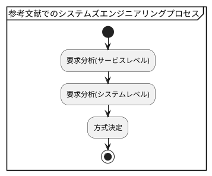
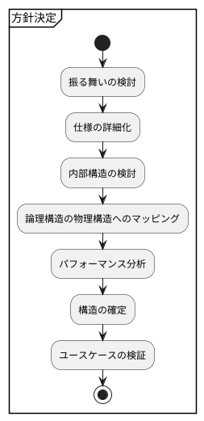
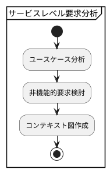
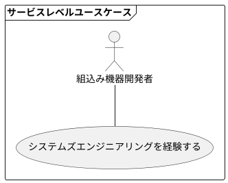
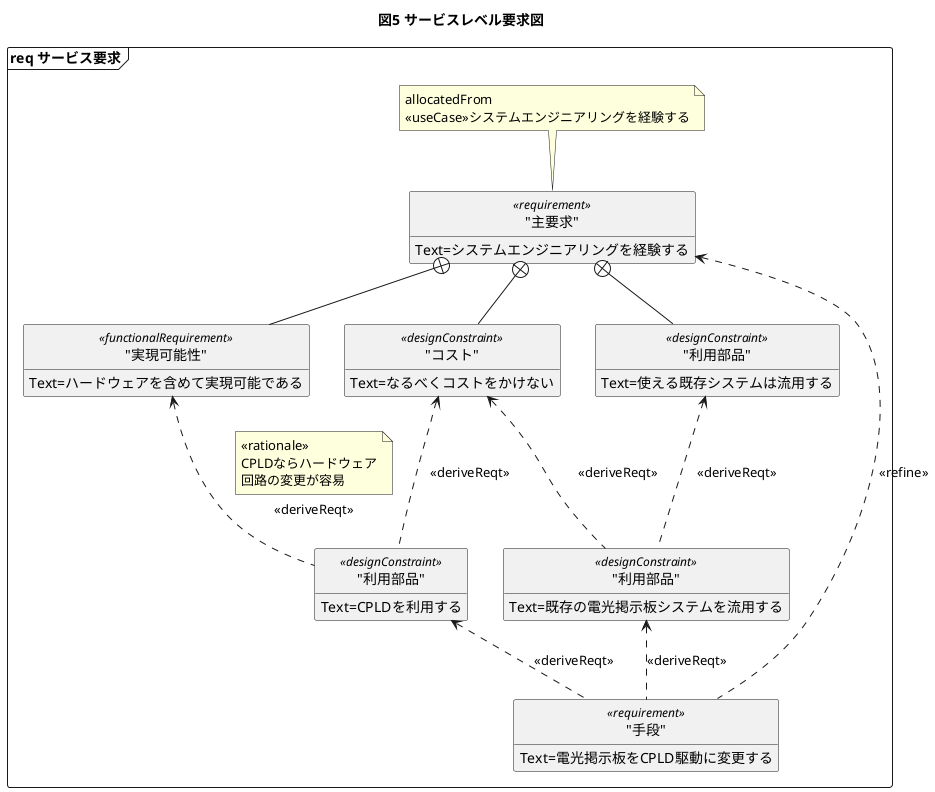
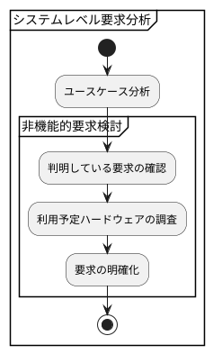
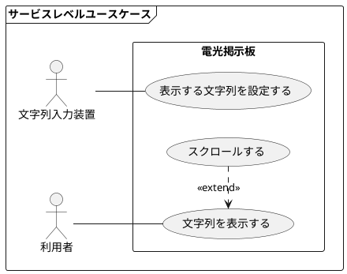
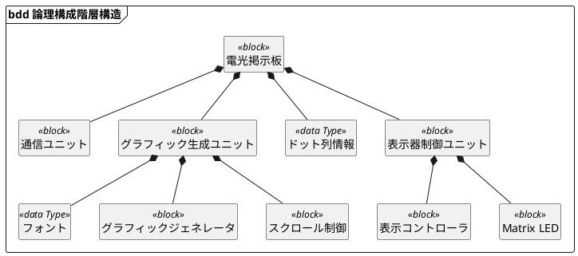

# SysML TIPS

## Systems Engineeringの標準プロセス
システムズエンジニアリングは対象にあったプロセスに従って実施していく  
どのプロセスも大まかには「要求分析」⇒「アーキテクチャ設計」を行う  
世界標準のプロセスは以下三つ
 * ISO/IEC15288: 広い範囲をカバー
 * ANSI/EIA-632: 中くらいをカバー
 * IEEE1220: 開発のみをカバーしているが詳細度が高い

 さらにSysMLを使ったMBSEを行う汎用プロセスは以下が有名  
 * OOSEM（Object-Oriented Systems Engineering Method）
   * INCOSEの提供するMBSEプロセス
   * 「システムズモデリング言語SysML」で紹介
 * SYSMOD（SYStems MODeling process）
   * 「 SysML/UMLによるシステムエンジニアリング入門」で紹介
 * Harmony for Systems Engineering
   * IBM社の提供するMBSEプロセス

JAXAでは[ここ](https://ssl.tksc.jaxa.jp/isasse01/kanren/BDB/BDB06007BSEkihon.pdf)に示すようなシステムズエンジニアリングプロセスを設定してる。

趣味のものつくりの為に自分用のエンジニアリングプロセスを設定する!　　

---
## SysMLのダイアグラム
UMLでは13個だったのがSysMLでは9個  
UMLはソフトウェアの詳細設計フェーズでも使用するのに対してSysMLは概念検討までしか使わないから少ないダイアグラムでもよい  
SysML特有なのは要求図とパラメトリック図  

---
## どのプロセスでどのダイアグラムを使うか
 ISO/IEC15288 (JIS X0170)のプロセスと使えるダイアグラムの一覧  

趣味のものつくりでは利害関係者要求定義プロセスはいらなさそう  

参考文献でのプロセスを以下アクティビティー図で示す。

---

## サービスレベル要求分析

### 1. ユースケース分析

楕円がユースケースで、システム外部から識別できる機能単位で記述します。 よく内部処理の単位でユースケースが書かれている例を見ますが、これは間違いです。 外部から識別できる機能に着目します。
人型をしている図形はアクターと呼ばれ、システムのステークホルダ (利害関係者) を表します。
### 2. 非機能的要求検討

要求図は UML には存在しない SysML 独自のダイアグラムで、非機能的要求を含めた要求を記述するために用いられます。
要求は複数の要求の集合として表すことができ、ネストを用いて表現します。 要求にはさまざまな種類があり、ユーザが独自にステレオタイプ requirement を拡張しても良いことになっています。
要求は機能要求 (functionalRequirement)、設計制約 (designConstraint) から検討される
派生要求は(deriveReqt)で表す 
元の要求を洗練する場合は (refine) する

### 3. コンテキスト図作成
⇒SYSMLでは定義されていない。1.2で定めたものを明確化しただけ

---

## システムレベル要求分析

### 1.ユースケース分析

### 2.非機能的要求検討

---